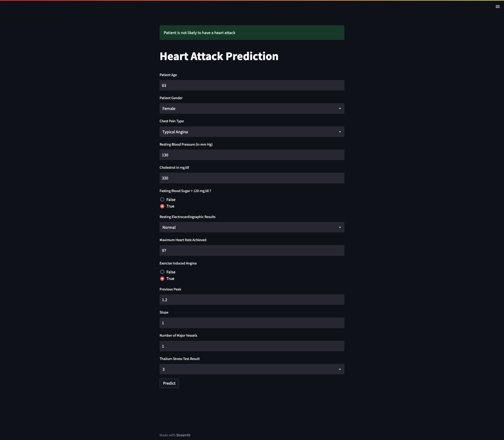
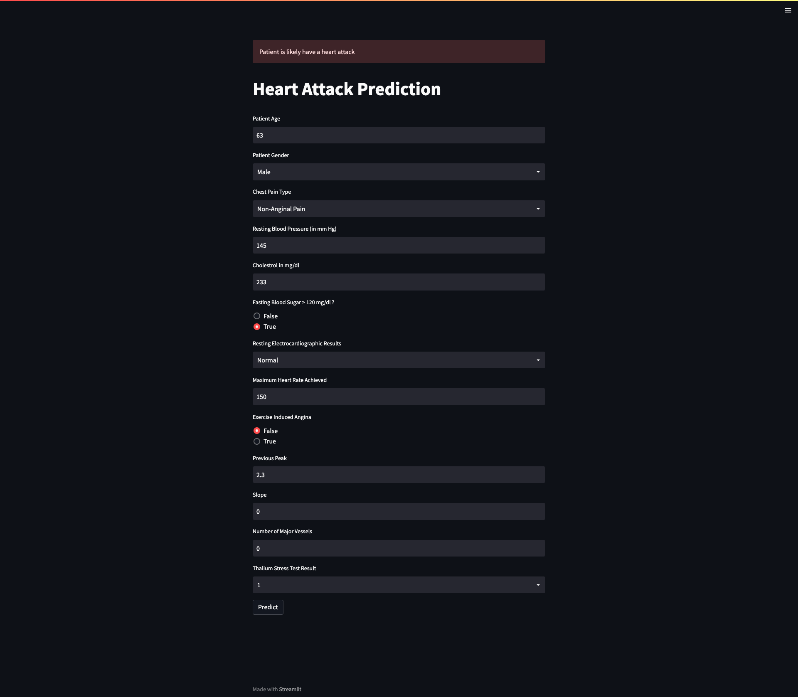

    
    

# Heart Attack Prediction App with Streamlit
Deployed Random Forest classifier to predict whether patient is likely to have a heart attack or not.

## Data:
[Heart Attack Analysis & Prediction Dataset](https://www.kaggle.com/datasets/rashikrahmanpritom/heart-attack-analysis-prediction-dataset)

## Model:
An experiment was conducted to test different Scikit models such as RF, LR, and etc... 

The best performing model was Random Forest Classifier with %85 accuracy.

## App Screenshots:

